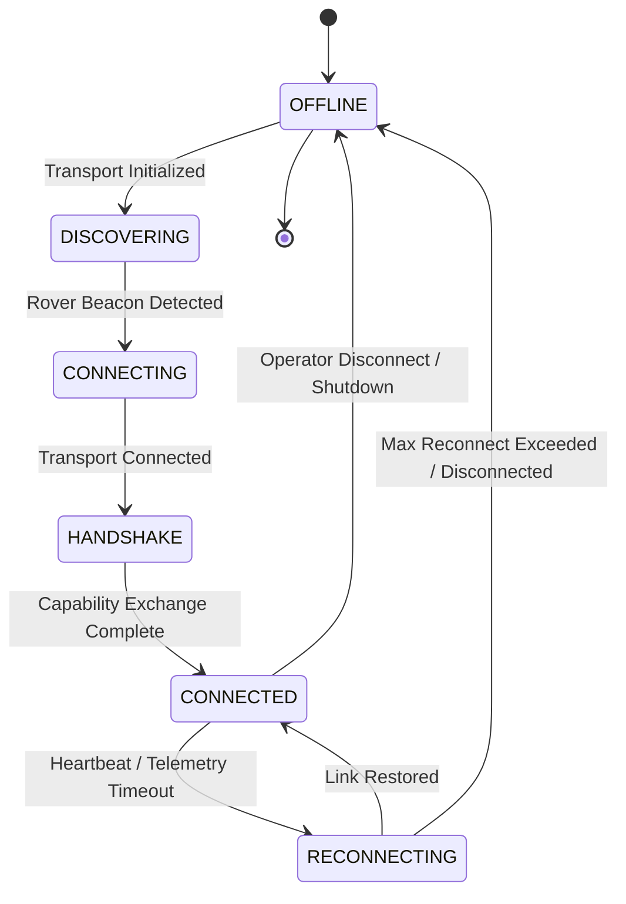
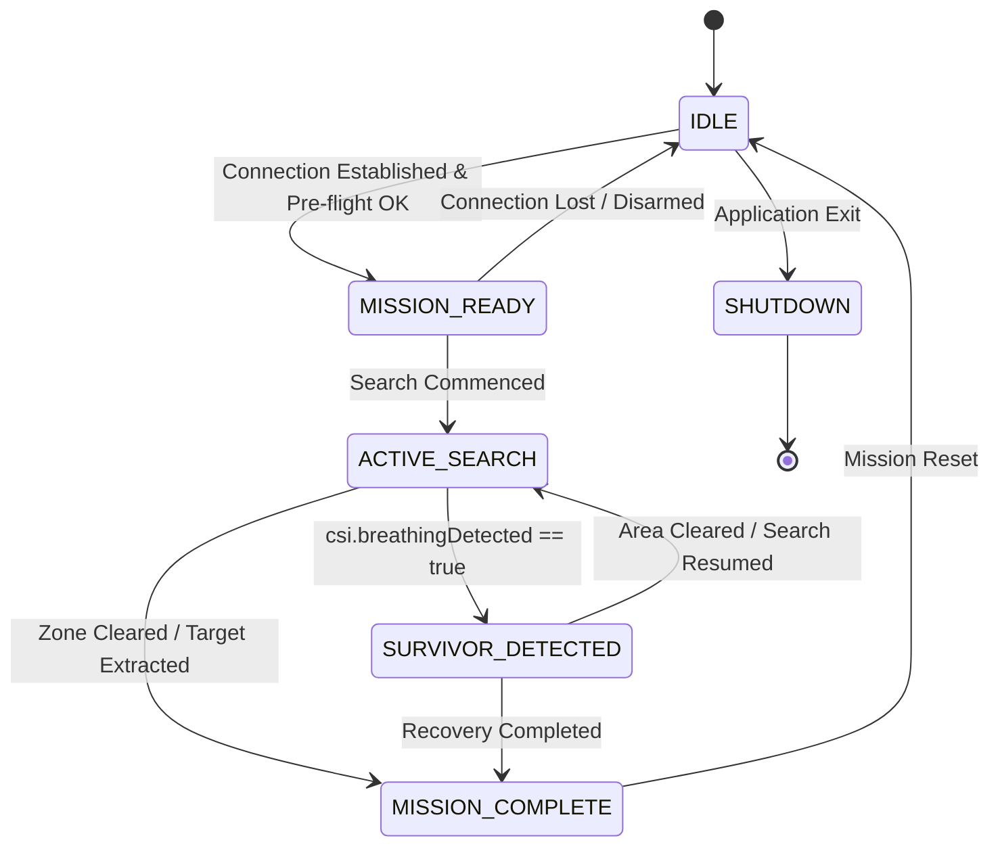

# K9Mesh Ground Control Station (GCS) Operational Specification

**Document Identifier:** K9M-SPEC-GCS-001  
**Revision:** 1.1.0  
**Classification:** Engineering Specification — Operational Design  
**Author:** DeepMind / K9Mesh Core Systems Engineering  
**Governing Documents:** [`docs/ICD.md`](file:///f:/dumpbox/sih2026/docs/ICD.md), K9Mesh Architecture Baseline v2.0.0  
**Target Platform:** Ruggedized Field Operator Station (Windows / Linux Native Desktop)

---

## 1. Executive Summary & Operational Scope

The **K9Mesh Ground Control Station (GCS)** is the authoritative command and telemetry visualization terminal for the K9Mesh Autonomous Search & Rescue Rover platform. 

The software operates as a standalone native desktop application packaged via Electron and executed on the field operator's rugged workstation. The operator console is built to emulate aerospace and military instrument panels:
- **Interface Freeze:** Zero UI alterations, widget resizing, layout reorganization, or color modifications are permitted. The existing, high-contrast, terminal-aesthetic operator console is final and complete.
- **Zero-Touch Field Deployment:** The operator launches the binary executable (`k9mesh.exe`). The application automatically provisions the internal runtime host, initializes data validation rules, discovers the rover via the active transport layer, negotiates capability parameters, and seamlessly switches from offline standby to real-time live telemetry display.

---

## 2. Desktop Application Architecture & Operational Overview

```
+----------------------------------------------------------------------------------------------------+
|                                    RUGGED OPERATOR WORKSTATION                                     |
|                                                                                                    |
|  +----------------------------------------------------------------------------------------------+  |
|  |                             ELECTRON MAIN PROCESS (RUNTIME HOST)                             |  |
|  |                                                                                              |  |
|  |  +────────────────────────────────────────────────────────────────────────────────────────+  |  |
|  |  |                              Rover Discovery & Transport Engine                         |  |  |
|  |  |  [Transport Layer Plugin]  <───>  (Adheres to approved Transport Specification)         |  |  |
|  |  +────────────────────────────────────────────────────────────────────────────────────────+  |  |
|  |                                                │ Raw Ingested Packets                        |  |
|  |                                                ▼                                             |  |
|  |  +────────────────────────────────────────────────────────────────────────────────────────+  |  |
|  |  |                     TelemetryValidator Layer (Open/Closed Orchestrator)                 |  |  |
|  |  |  • SchemaValidationRule      • TimestampValidationRule                                 |  |  |
|  |  |  • EngineeringValidationRule • EnumValidationRule                                      |  |  |
|  |  +────────────────────────────────────────────────────────────────────────────────────────+  |  |
|  |                                                │ Validated Packets                           |  |
|  |                                                ▼                                             |  |
|  |  +────────────────────────────────────────────────────────────────────────────────────────+  |  |
|  |  |                                  TelemetryHost Manager                                 |  |  |
|  |  |  • Connection State Machine  • Capability Negotiator  • Heartbeat & Watchdog Timers    |  |  |
|  |  +────────────────────────────────────────────────────────────────────────────────────────+  |  |
|  |                                                │ Host Diagnostics                            |  |
|  |                                                ▼                                             |  |
|  |  +────────────────────────────────────────────────────────────────────────────────────────+  |  |
|  |  |                          SystemHealthManager (Internal Subsystem)                      |  |  |
|  |  |  • Packet Freshness & Age    • IPC Latency Tracker    • Packet Loss & Drop Counters    |  |  |
|  |  |  • Runtime Uptime            • CPU/Memory Profile     • Diagnostic Log Journal         |  |  |
|  |  +────────────────────────────────────────────────────────────────────────────────────────+  |  |
|  +------------------------------------------------│---------------------------------------------+  |
|                                                   │ IPC Push (`window.k9mesh.telemetry`)           |
|  +------------------------------------------------│---------------------------------------------+  |
|  |                                                ▼                                             |  |
|  |                          REACT OPERATOR CONSOLE (RENDERER PROCESS)                           |  |
|  |                                                                                              |  |
|  |  +────────────────────────────────────────────────────────────────────────────────────────+  |  |
|  |  |                     ElectronTelemetryProvider ──> TelemetryMapper                     |  |  |
|  |  +────────────────────────────────────────────────────────────────────────────────────────+  |  |
|  |                                                │ Pure State                                  |  |
|  |                                                ▼                                             |  |
|  |  +────────────────────────────────────────────────────────────────────────────────────────+  |  |
|  |  |                             FROZEN OPERATOR INSTRUMENT PANEL                           |  |  |
|  |  |  • System Vitals      • CSI Survivor Detection  • Motion Detector                      |  |  |
|  |  |  • Heading / IMU      • Odometry (4WD RPM)      • GPS Coordinates                      |  |  |
|  |  +────────────────────────────────────────────────────────────────────────────────────────+  |  |
|  +----------------------------------------------------------------------------------------------+  |
+----------------------------------------------------------------------------------------------------+
```

---

## 3. Desktop Application Lifecycle

The application lifecycle guarantees deterministic startup, autonomous link negotiation, and clean teardown during field operations.

```
       [Operator Launches K9Mesh.exe]
                     │
                     ▼
        [1. Electron Runtime Boot]
  • Initializes main process event loop
  • Loads secure preload sandbox (contextIsolation: true, nodeIntegration: false)
                     │
                     ▼
         [2. Host Subsystem Init]
  • Instantiates TelemetryHost & SystemHealthManager singletons
  • Registers IPC handlers (k9mesh:telemetry:*)
  • Constructs TelemetryValidator rule composition chain
                     │
                     ▼
        [3. Transport Layer Activation]
  • Initializes transport provider per approved Transport Specification
  • Connection State: OFFLINE ──> DISCOVERING
  • UI renders deterministic null baseline (NULL_TELEMETRY)
                     │
                     ▼
         [4. Link & Capability Handshake]
  • Executes Discovery ──> Handshake ──> Capability Exchange ──> Telemetry Enable
  • Connection State transitions: CONNECTED
  • Mission State transitions: IDLE ──> MISSION_READY
                     │
                     ▼
         [5. Live Telemetry Stream]
  • Telemetry packets streamed at configured rate
  • TelemetryValidator enforces physical bounds and schema contracts
  • SystemHealthManager monitors packet freshness and pipeline health
  • TelemetryMapper populates React console state
                     │
                     ▼
        [6. Active Mission Execution]
  • Watchdogs monitor heartbeat and packet intervals
  • Telemetry dropouts trigger automatic link recovery procedures
                     │
                     ▼
         [7. Graceful Application Exit]
  • Operator initiates shutdown
  • Host disarms telemetry link and cleans up IPC channels and network sockets
```

---

## 4. Rover Uplink, Handshake & Capability Negotiation

> [!NOTE]
> Physical transport implementation (framing, discovery protocols, transport sockets, and packet serialization) shall follow the approved **Transport Specification**.

### 4.1 Connection Negotiation Sequence

Uplink establishment follows a strict, multi-stage handshake separating network discovery from capability negotiation:

```
GCS (TelemetryHost)                                      Rover Onboard Controller
        │                                                          │
        │ ────────────── 1. DISCOVERY (Beacon Probe) ────────────> │
        │ <───────────── 2. DISCOVERY (Beacon Reply) ───────────── │
        │                                                          │
        │ ────────────── 3. HANDSHAKE (SYN + Epoch) ─────────────> │
        │ <───────────── 4. HANDSHAKE (ACK + Clock Offset) ─────── │
        │                                                          │
        │ <───────────── 5. CAPABILITY ADVERTISEMENT ───────────── │
        │    (FW Version, Subsystems: STM32, ESP32, IMU, CSI...)   │
        │                                                          │
        │ ────────────── 6. CAPABILITY ACCEPT / NEGOTIATE ───────> │
        │    (Protocol v2.0, Configured Stream Rate)               │
        │                                                          │
        │ ────────────── 7. TELEMETRY ENABLE ────────────────────> │
        │ <───────────── 8. TELEMETRY STREAM ACTIVE ────────────── │
        │                                                          │
```

1. **Discovery:** GCS locates the rover via active transport channels and establishes link availability.
2. **Handshake:** GCS and Rover exchange sequence synchronization packets and compute epoch clock drift.
3. **Capability Advertisement:** Rover transmits its firmware version, active hardware subsystems (e.g., STM32, ESP32, MPU9250, CSI Array, Optocouplers, GPS), and supported feature sets.
4. **Capability Negotiation:** GCS confirms protocol compatibility (e.g., ICD v2.0) and negotiates active telemetry profiles.
5. **Telemetry Enable:** GCS sends activation command; Rover initiates continuous telemetry transmission.

### 4.2 Runtime Configuration Independence

To ensure operational flexibility across varied field conditions, communication timing parameters are managed as configurable runtime parameters rather than hardcoded constants:

| Parameter | Identifier | Configurable Range | Default Nominal Value | Description |
| :--- | :--- | :---: | :---: | :--- |
| **Heartbeat Interval** | `T_HEARTBEAT` | $200\text{ ms} - 5000\text{ ms}$ | $1000\text{ ms}$ | Frequency of keepalive pings emitted by GCS to rover. |
| **Rover Watchdog Timeout** | `T_WATCHDOG` | $500\text{ ms} - 10000\text{ ms}$ | $1500\text{ ms}$ | Rover deadman timeout; rover halts motors if no heartbeat is received within this window. |
| **Telemetry Update Rate** | `F_TELEM` | $1\text{ Hz} - 50\text{ Hz}$ | $10\text{ Hz}$ | Target streaming frequency for full telemetry packets. |
| **Telemetry Stale Timeout** | `T_STALE` | $500\text{ ms} - 5000\text{ ms}$ | $2000\text{ ms}$ | Duration before GCS marks telemetry data as stale / disconnected. |
| **Max Clock Drift Allowance**| `T_MAX_DRIFT`| $100\text{ ms} - 60000\text{ ms}$ | $10000\text{ ms}$ | Maximum allowed time drift before timestamp warning is logged. |

---

## 5. System Health Management (`SystemHealthManager`)

The `SystemHealthManager` is a dedicated host-side diagnostics subsystem operating within the Electron runtime. It operates transparently in the background to ensure data reliability without altering the React operator interface.

### Responsibilities
- **Telemetry Freshness & Age:** Computes $\Delta t = t_{\text{current}} - t_{\text{packet\_epoch}}$ on every ingested frame.
- **IPC Transmission Latency:** Measures transit time between Electron Main broadcast and renderer reception.
- **Packet Metrics:** Maintains running counters for packets received, validated, dropped, corrupted, and retransmitted.
- **System Resource Monitoring:** Monitors GCS process CPU utilization and memory heap consumption.
- **Diagnostics Journal:** Logs timestamped diagnostic events, link state changes, and validation failure records for post-mission engineering review.

---

## 6. End-to-End Telemetry Data Flow to Existing UI Widgets

Every field in the frozen React console is deterministically fed from onboard sensors through the validation and mapping pipeline without frontend extrapolation or synthetic animation:

| UI Widget / Row | Onboard Sensor / Source | Processor | Wire Protocol (ICD) | Validation Rules | Displayed Value / Unit |
| :--- | :--- | :--- | :--- | :--- | :--- |
| **SYSTEM VITALS $\rightarrow$ LINK** | Comms RSSI / Link Metrics | ESP32 | `radio.linkQuality` | `EnumValidationRule` (`EXCELLENT`/`GOOD`/`FAIR`/`POOR`) | `EXCELLENT` / `GOOD` / `--` |
| **SYSTEM VITALS $\rightarrow$ LATENCY** | Round-trip ping timing | ESP32 / Host | `radio.latency` | $0 \le \text{latency} \le 1000\text{ ms}$ | `XX MS` |
| **SYSTEM VITALS $\rightarrow$ SIGNAL** | RSSI percentage | ESP32 | `radio.signalPercent` | $0 \le \text{percent} \le 100\%$ | `[██████----] XX%` |
| **SYSTEM VITALS $\rightarrow$ STM32_MCU** | STM32 Watchdog heartbeat | STM32 $\rightarrow$ ESP32 | `hardware.stm32` | `EnumValidationRule` (`OK`/`FAULT`/`OFFLINE`) | `OK` / `FAULT` / `--` |
| **SYSTEM VITALS $\rightarrow$ ESP32_COM** | ESP32 RTOS core status | ESP32 | `hardware.esp32` | `EnumValidationRule` (`OK`/`FAULT`/`OFFLINE`) | `OK` / `FAULT` / `--` |
| **SYSTEM VITALS $\rightarrow$ MQTT_BROKER** | Embedded broker socket | ESP32 | `hardware.mqtt` | `EnumValidationRule` (`OK`/`FAULT`/`OFFLINE`) | `OK` / `FAULT` / `--` |
| **SYSTEM VITALS $\rightarrow$ WIFI_LINK** | Network link status | ESP32 | `hardware.wifi` | `EnumValidationRule` (`OK`/`FAULT`/`OFFLINE`) | `OK` / `FAULT` / `--` |
| **SYSTEM VITALS $\rightarrow$ CORE TEMP** | Internal junction sensor | STM32 / ESP32 | `hardware.coreTemp` | $-40^\circ\text{C} \le \text{temp} \le +85^\circ\text{C}$ | `XX.X°C` |
| **SYSTEM VITALS $\rightarrow$ BATTERY %** | ADC Voltage Divider (2S LiPo) | STM32 | `battery.percent` | $0 \le \text{percent} \le 100\%$ | `[████████--] XX%` |
| **SYSTEM VITALS $\rightarrow$ VOLTAGE** | Direct analog bus voltage | STM32 | `battery.voltage` | $0.0 \le \text{voltage} \le 8.4\text{V}$ | `X.XXV` |
| **SYSTEM VITALS $\rightarrow$ EST TIME** | Coulomb counter estimator | STM32 | `battery.estTime` | Regex `^\d{2}:\d{2}:\d{2}$` | `HH:MM:SS` |
| **SYSTEM VITALS $\rightarrow$ DISCHARGE** | Shunt current sensor | STM32 | `battery.discharge` | `EnumValidationRule` (`NORMAL`/`HIGH`/`CRITICAL`) | `NORMAL` / `HIGH` |
| **CSI SURVIVOR $\rightarrow$ STATUS** | Micro-ESPectre CSI pipeline | ESP32 | `csi.breathingDetected` | Boolean check (`true`/`false`) | `BREATHING DETECTED` |
| **CSI SURVIVOR $\rightarrow$ RATE** | Subcarrier FFT peak tracker | ESP32 | `csi.breathingRate` | $0 \le \text{rate} \le 60\text{ BPM}$ | `XX BPM` |
| **CSI SURVIVOR $\rightarrow$ CONFIDENCE** | Spectral power SNR ratio | ESP32 | `csi.confidence` | $0 \le \text{confidence} \le 100\%$ | `XX%` |
| **CSI SURVIVOR $\rightarrow$ STATE** | Markov state estimator | ESP32 | `csi.state` | `EnumValidationRule` (`STABLE`/`MOTION`/`IDLE`) | `STABLE` / `MOTION` |
| **MOTION DETECTOR $\rightarrow$ STATE** | Micro-ESPectre variance | ESP32 | `motion.level` | `EnumValidationRule` (`LOW`/`MEDIUM`/`HIGH`) | `LOW` / `MEDIUM` / `HIGH` |
| **MOTION DETECTOR $\rightarrow$ LAST EVENT**| Epoch delta from motion trigger| ESP32 | `motion.lastEventSeconds`| Numeric non-negative integer | `T - XX` |
| **HEADING / IMU $\rightarrow$ HEADING** | MPU9250 Magnetometer + Madgwick | STM32 | `imu.heading` | $0.0^\circ \le \text{heading} \le 359.99^\circ$ | `XXX° [CARDINAL]` |
| **HEADING / IMU $\rightarrow$ PITCH / ROLL** | MPU9250 Accelerometer/Gyro | STM32 | `imu.pitch`, `imu.roll` | Pitch: $\pm 90^\circ$, Roll: $\pm 180^\circ$ | `PITCH: XX° \| ROLL: XX°` |
| **ODOMETRY $\rightarrow$ SPEED / DIST** | FC-03 Dual Optocoupler encoders| STM32 | `odometry.speed`, `distance` | Speed: $0-5\text{m/s}$, Dist: $0-9999\text{m}$ | `SPEED: X.XX M/S \| DIST: XXX M` |
| **ODOMETRY $\rightarrow$ MOTORS (FL/FR/RL/RR)** | Per-wheel pulse integration | STM32 | `odometry.motors.*` | $0 \le \text{RPM} \le 1000$ | `FL: XXX RPM` |
| **GPS NAV $\rightarrow$ LAT / LON** | NMEA-0183 ($1\text{ Hz}$ parse) | STM32 | `gps.latitude`, `longitude` | Lat: $\pm 90.0$, Lon: $\pm 180.0$ | `LAT: XX.XXXX N \| LON: XX.XXXX E` |

---

## 7. Independent Operational State Machines

Operational concerns are segregated into two completely decoupled state machines:
1. **Connection State Machine:** Governs network link, transport, and synchronization liveliness.
2. **Mission State Machine:** Governs operational Search & Rescue progression and tactical execution.

### 7.1 Connection State Machine



- **`OFFLINE`**: No active transport connection; UI renders disconnected baseline (`--`).
- **`DISCOVERING`**: Listening for rover discovery beacons on active transport interfaces.
- **`CONNECTING`**: Transport layer connection opened.
- **`HANDSHAKE`**: Exchanging sequence synchronization, capability advertisement, and clock drift.
- **`CONNECTED`**: Validated telemetry streaming actively; heartbeat watchdogs engaged.
- **`RECONNECTING`**: Telemetry dropped for $> T_{\text{STALE}}$; actively attempting link recovery while rover executes deadman hold.

---

### 7.2 Mission State Machine



- **`IDLE`**: Rover disarmed; awaiting operational activation.
- **`MISSION_READY`**: Rover online, all hardware subsystems reporting `OK`, battery and sensors nominal.
- **`ACTIVE_SEARCH`**: Rover actively navigating void space and continuously sampling CSI RF fields.
- **`SURVIVOR_DETECTED`**: High-confidence physiological breathing signature confirmed; console displays survivor vitals.
- **`MISSION_COMPLETE`**: Search goals completed; rover recalled to base.
- **`SHUTDOWN`**: Clean mission shutdown and application exit.

---

## 8. Failure Mode & Recovery Matrix

| Fault Event | Detection Mechanism | Rover Behavior | GCS / Console Behavior | Recovery Procedure |
| :--- | :--- | :--- | :--- | :--- |
| **Transport Link Loss** | Heartbeat timeout ($> T_{\text{WATCHDOG}}$) | Halts motors; switches radio to listen-only | Connection State transitions to `RECONNECTING`; comms row shows `POOR` / `DISCONNECTED` | Automatic background re-discovery; resumes telemetry on link restore. |
| **Manual Control Loss** | Control packet loss ($> 500\text{ ms}$) | Disables manual drive; holds steering neutral | `radio.linkQuality` drops to `POOR` | Operator repositions antenna or switches transport link. |
| **Battery Critical ($\le 15\%$)** | ADC voltage $< 6.6\text{V}$ | Throttles maximum motor speed by 50% | `battery.discharge` indicates `CRITICAL`; meter shows low charge | GCS logs critical alert; operator recalls rover for battery swap. |
| **CSI Array Offline / Fault** | Micro-ESPectre packet drop | Disables breathing detector pipeline | `csi.state` indicates `IDLE` or `FAULT`; footer flags `OFFLINE` | ESP32 performs warm restart of CSI subcarrier receiver task. |
| **IMU I2C Lockup** | I2C Bus timeout ($> 100\text{ ms}$) | Uses wheel odometry fallback for heading | `imu.heading` displays last valid or `--` | STM32 sends I2C bus clear sequence and reinitializes IMU. |
| **Motor Driver Fault** | Overcurrent shunt trip | Disables PWM drive pins to motors | `odometry.motors.*` reports `0 RPM`; `odometry.speed` reports `0.00 M/S` | Operator checks chassis for obstruction; GCS sends software fault clear command. |

---

## 9. Forward Compatibility & Frozen UI Invariant

> [!IMPORTANT]
> The K9Mesh Operator Console interface is permanently frozen. No future sensor or subsystem additions shall alter the layout, styling, or existing widget contracts of the operator console.

All future payload expansions integrate strictly through the backend runtime architecture:

```
[Future Sensor Payloads]
  • Thermal Imaging Array (MLX90640 / Lepton) ──┐
  • Hazardous Gas Array (MQ-4 / MQ-7)          ──┼──> [Secondary Processor / Task]
  • Solid-State Micro-LiDAR                    ──┤                  │
  • Swarm / Multi-Rover Mesh Routing           ──┘                  ▼
                                                        [Appends Extended ICD Envelope]
                                                                    │
                                                                    ▼
                                                        [Electron TelemetryHost]
                                                        (Registers Custom ValidationRule)
                                                                    │
                                                                    ▼
                                                        [Auxiliary Process / Window
                                                         Existing UI Unaltered]
```

1. **Thermal Imaging:** Thermal video streams transmit over independent auxiliary channels (e.g., WebRTC or secondary IPC) to separate display windows without modifying the core telemetry pipeline.
2. **Hazardous Gas Sensing:** Gas concentration metrics slot cleanly into the ICD payload envelope as optional extensions validated by independent `ValidationRule` modules.
3. **Swarm Robotics:** Multi-rover operations are managed by `TelemetryHost` instantiating distinct `TelemetrySource` instances per Rover ID (`rover-01`, `rover-02`), preserving the deterministic single-vehicle console contract.

---

## 10. Recommended Documentation Suite Architecture

To maintain clear separation of engineering concerns across the project lifecycle, project documentation is structured into the following dedicated specifications:

| Document Path | Title | Engineering Scope & Purpose |
| :--- | :--- | :--- |
| [`docs/GCS_Operational_Spec.md`](file:///f:/dumpbox/sih2026/docs/GCS_OPERATIONS.md) | **Ground Control Station Operational Specification** | GCS desktop application lifecycle, operational state machines (Connection & Mission), health management, and operator workflows. |
| `docs/Transport_Spec.md` | **Transport Layer Specification** | Physical media protocols, framing contracts, discovery mechanisms (WiFi, MQTT, USB CDC Serial), socket management, and reconnect policies. |
| `docs/Mission_State_Machine.md` | **Mission State Machine & Tactics Specification** | Detailed Search & Rescue field tactical procedures, victim triage state transitions, and operational safety rules. |
| [`docs/ICD.md`](file:///f:/dumpbox/sih2026/docs/ICD.md) | **Master Interface Control Document** | Authoritative data model contracts, JSON wire serialization schemas, field constraints, engineering units, and enumerations. |
| `docs/Validation.md` | **Telemetry Validation & Integrity Specification** | Composable validation rule architectures, bounds verification, enum checking, and error/warning/info classification. |
| `docs/Architecture.md` | **System Architecture Specification** | End-to-end multi-tier architecture, Electron Main process boundaries, secure IPC preload bridges, and React presentation design. |
